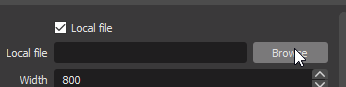
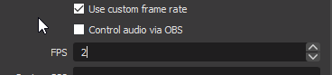

<!-- # COH2 LAGGER BUG VERSION
Use <a id="raw-url" href="https://github.com/sepi4/myCeloJs/raw/ladderBug/sepi-celo%20Setup%20666.666.666.exe" > THIS </a> version untill relic haven't fixed ladder bugs.  -->

# About

This is electron app for viewing ranks of current connected game
of Company of Heroes 2 and display ranks in OBS.

Thanks to <a id="raw-url" href="https://github.com/RosboneMako/MakoCelo">Rosbone/MakoCelo</a> for ideas. It's also rank displayer for COH2, check it out, maybe you like it better. 

<!--
<a id="raw-url" href="https://github.com/sepi4/myCeloJs/releases/download/1.3.0/sepi-celo.Setup.1.3.0.exe">Download setup file</a>
-->

## Install and setup:

- download zip file (<a id="raw-url" href="https://github.com/sepi4/myCeloJs/releases/latest">latest release</a>)
- extract
- double click 'myCelo.exe'
- in settings  select 
    location of 'warnings.log' file (Same folder where are replays saved, usually 
    in "C:\Users\USERNAME\Documents\my games\company of heroes 2\") 

- **OPTIONAL (for streamers)**, simple way for OBS studio to display ranking:
    - select format of rankings output  file, html 
    
     

    or txt 
    
     

    Location can be copied to clipboard by pressing 'copy' button.

    . 

    - make OBS studio to display rankings file info:
        - for **HTML**:
            - Sources > Add (plus) > Browser 
        
                . 

            - Select checkbox 'local file', select location of rankings output file 
            (copied above)
            
                 

            - Select checkbox 'Use custom frame rate', put 2 FPS (same rate as ranking html 
            file will update), this will remove flickering. 

                

            - Modify size of new window. Test in game vs AI. 

        - for **TXT**:
            - Sources > Add (plus) > Text. 

                

            - select checkbox 'read from file' 
            - select location of rankings output file 

                

            - modify size of output, font, etc.  
            - test in game vs AI.

## Установка и настройка:

<a id="raw-url" href="https://www.youtube.com/watch?v=F9ayHIY1jTI">видео инструкция (rus)</a>

<!-- - скачайте установочный файл (Download setup file)
- установите
- в настройках укажите местонахождение 'warnings.log' файла (тоже место куда 
сохраняются реплеи, обычно в C:\Users\USERNAME\Documents\my games\company of heroes 2\)
- (необязательно) простой метод для OBS studio показывать ранги участников
    - в настройках выберите местонахождение выходного текстового файла куда будут писаться ранги (может находиться где угодно)
    - сделать так, чтобы OBS studio отображала этот текстовый файл с рейтингами
        - Источники > Добавить (плюс) > Текст (укажите место нахождение выше
         созданного файла). Настроите размер текста, фонт... -->

## Updates:
* **version 1.4.0.** 
    - Now in OBS-studio ranking display is possible in html. This will show flag pictures
    - Player ranking can be view in table mode (navbar checkboxes)
    - App is now packed in zip-file. Installation is extraction of this file. 
    - Source code: separated React component in to separate files
* **version 1.3.0.** 
    - Added rankings display in replays
        - _Rankings can be in some cases incorrect (team games), because log file is not 
        provading information of teams struction. Program is trying to make educated guess
        of a rankings_
* **version 1.2.0.** 
    - Update panel to download updated version of an app.
* **version 1.1.0.** 
    - Custom ranking file for OBS can be added now in settings.    
    - Partially works with replays. All ranks can be easily viewed in drop 
        down menu.

