- [About](#about)
- [Install and setup:](#install-and-setup)
- [Установка и настройка:](#установка-и-настройка)
- [Updates:](#updates)

## About

This is electron app for viewing ranks of current connected game of Company of Heroes 2 and display ranks in OBS.

Thanks to <a id="raw-url" href="https://github.com/RosboneMako/MakoCelo">Rosbone/MakoCelo</a> for ideas. It's also rank display for COH2, check it out, maybe you like it better. 

## Install and setup:

- download zip file (<a id="raw-url" href="https://github.com/sepi4/myCeloJs/releases/latest">latest release</a>)
- extract
- double click 'myCelo.exe'
- allow in firewall if asked *(permission is needed because app is serving ranking.json file to localhost, so that it can read by javascript in ranking.html file every second and update it if needed)*

- in settings 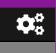 select location of 'warnings.log' file (Same folder where are replays saved, usually in "C:\Users\USERNAME\Documents\my games\company of heroes 2\")
- done (test installation by opening game in SPECTATE MODE or game vs AI.)
 

 
 **OPTIONAL SETTINGS** 

- select language
- add your steam ID. This will make your player card icon appear on navbar
- default player link site. Used only in history view player links.  

*ONLY FOR STREAMERS* 

- simple way for OBS studio to display ranking:
    - select rankings output  file format and orientations, **html**:
    
        **horizontal**:
    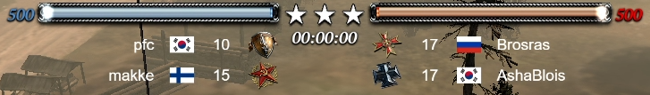 

        **vertical**:
    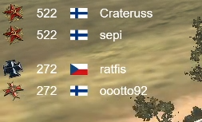 

        or **txt**:
        **horizontal**:
    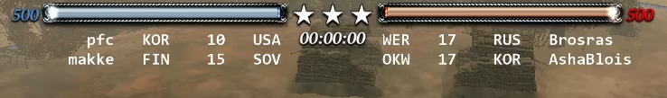 

        **vertical**:
    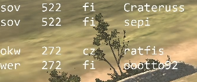 

    - Location can be copied to clipboard by pressing 'copy' button.

        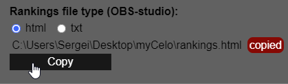. 

    - make OBS studio to display rankings file info:
        - for **HTML**:
            - Sources > Add (plus) > Browser 
        
                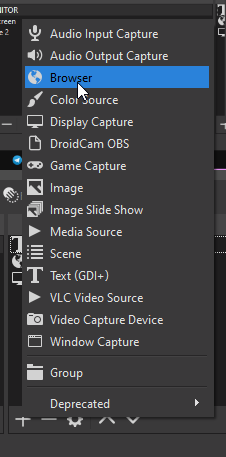. 

            - Paste rankings.html file location (copied above) to URL input 
            - Set the same width and height that your display screen resolution is
                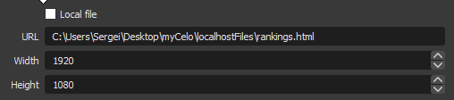 

            - Select checkbox 'Refresh browser when scene becomes active' 

                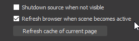

            - Modify size of new window. Test in game vs AI. 

        - for **TXT**:
            - Sources > Add (plus) > Text. 

                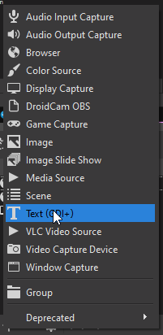

            - select checkbox 'read from file' 
            - select location of rankings output file 

                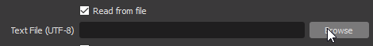

            - modify size of output, font (for horizontal view you have to find monospace font, Consolas worked for me), etc.  

## Установка и настройка:

- скачайте zip-файл (<a id="raw-url" href="https://github.com/sepi4/myCeloJs/releases/latest">latest release</a>)
- распакуйте zip-файл
- откройте "myCelo.exe"
- если фаервол попросит разрешения, разрешите *(программа использует localhost чтобы rankings.json можно было прочитать с помощью javascript и обновлять rankings.html если это необходимо)*

- в настройках  выберите местонахождение 'warnings.log'-файла (тоже место куда сохраняются реплеи, обычно находится в "C:\Users\USERNAME\Documents\my games\company of heroes 2\\") 
- проверьте установку в игре против компьютера или в режиме просмотра

 **НЕОБЯЗАТЕЛЬНЫЕ НАСТРОЙКИ** 

- выбор языка
- установка вашего стеам ID. После чего на верхней панели появится иконка со ссылкой на вашу статистику.
- выбор дефолтного сайта для ссылок игрока. Используется только на окне истории игры.  

*ТОЛЬКО ДЛЯ СТРИМЕРОВ* 

- отображение рангов на стриме через OBS-studio:
    - выберите формат и ориентацию:    
       **html горизонтально**:
     

       **html вертикально**:
     

       **txt горизонтально**:
     

       **txt вертикально**:
     
    
    - Выберите формат. Скопируйте адрес нажав кнопку 'Copy'.

        

    - **Настойки в OBS-studio**:
        - для формата **HTML**:
            - Источники > Добавить(плюс) > Браузер 
        
                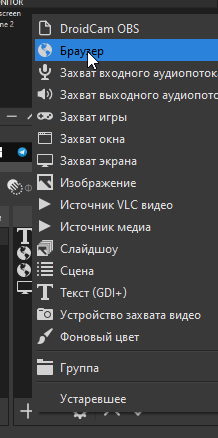. 

            - вставьте в "Адрес URL" местонахождение файла rankings.html (скопировали из настроек myCelo)
            - сделайте ширину 1920 и высоту 1080

                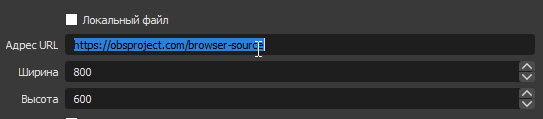 

            - поставьте галочку на "Обновить браузер, когда сцена становится активной"
            
                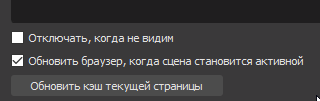

            - сделайте новое окно подходящего размера и поместите куда хотите на экране

        - для формата **TXT**:
            - Источники > Добавить(плюс) > Текст 
        
                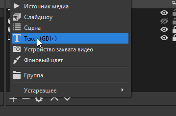

            - поставьте галочку на "чтение из файла" 
            - выберите местонахождение файла (скопировали его из настроек myCelo)

                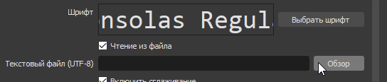

            - сделайте новое окно подходящего размера, выберите подходящий фонт и поместите окно куда хотите на экране (для горизонтального формата, вам надо найти подходящий фонт, например Consolas)
            - проверьте установку в игре против компьютера 

## Updates:
* **version 1.8.1.** 
    - Bugfix
* **version 1.8.0.** 
    - Add player card view
    - Add steam id option to settings
    - Add language option in settings
    - Add translations: en, ru
    - Add basic search view
    - Add navbar links to my player card and search
    - Add default web player link option in settings
* **version 1.7.1.** 
    - updated links to https://coh2stats.com
* **version 1.7.0.** 
    - Add history modal that display history of resent games
    - Add indexes to arranged teams
    - Add sound alert when log checking is in auto mode
* **version 1.6.1.** 
    - Bug fix (current user team was some times on wrong positions, should always be first)
    - Small navbar visual changing
* **version 1.6.0.** 
    - Manual possibility to check log file 
    - Changing interval of auto checking log file
    - Bug fix same players not updating players object (adding time to players object)
* **version 1.5.1.** 
    - Small bug fix (in horizontal display, current user team position was some times on wrong side)
* **version 1.5.0.** 
    - Add horizontal and vertical rankings display possibility for html/txt
    - User settings should now remain the same after updating app
    - User can skip update version, by pushing 'ignore this version'
    - Little visual updates
* **version 1.4.3.** 
    - Add dropdown info sorting possibility by clicking column title
    - Fix nickname width bug
    - Code refactoring and optimization 
* **version 1.4.2.** 
    - Ranking file is now updating from json file - no flickering
    - Slight visual modification
    - Bug fixing
* **version 1.4.0.** 
    - Now in OBS-studio ranking display is possible in html. This will show flag pictures
    - Player ranking can be view in table mode (navbar checkboxes)
    - App is now packed in zip-file. Installation is extraction of this file. 
    - Source code: separated React component in to separate files
* **version 1.3.0.** 
    - Added rankings display in replays
        - _Rankings can be in some cases incorrect (team games), because log file is not providing information of teams structure. Program is trying to make educated guess of a rankings_
* **version 1.2.0.** 
    - Update panel to download updated version of an app.

